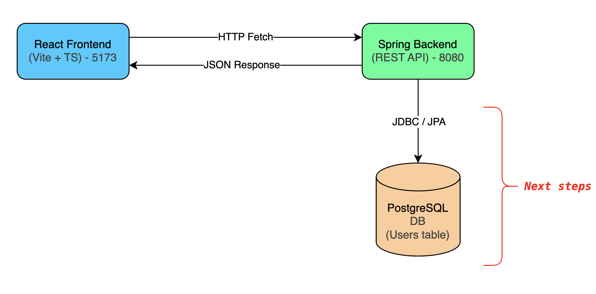

# BankingApp

A modern **full-stack banking application**. 

This project is being built step by step, starting from a minimal skeleton and evolving into a production-like system.


## 🟢 Current Features
- **Spring Boot backend** (Java 17+, REST API)
- **React frontend** (Vite + TypeScript)
- Frontend successfully calls a backend API (`/api/hello`) and displays the response
- Basic CORS configuration between frontend (`5173`) and backend (`8080`)


## ✏️ Architecture

<details>
<summary>Current State - Sept 2025</summary>


    
</details>

### 🧰 Tech Stack

- Frontend
    - React (with Vite + TypeScript)
    - Fetch API for backend communication

- Backend
    - Java 17+
    - Spring Boot
    - REST API

- Future Stack Additions
    - PostgreSQL database
    - JWT authentication
    - Docker + Docker Compose
    - GitHub Actions CI/CD
    - Cloud deployment
    - Unit + integration tests


### 🔄 Running the App

> Backend
```bash
cd bankapp-backend
./mvnw spring-boot:run
```
- Runs on: http://localhost:8080

> Frontend
```bash
cd bankapp-frontend
npm install
npm run dev
```
- Runs on: http://localhost:5173


📈 Roadmap
- Hello World API + frontend integration
- Mock User API endpoint
- Connect to PostgreSQL
- Add authentication (JWT)
- Dockerize services
- Implement CI/CD pipeline
- Write automated tests
- Extend domain (accounts, transactions, etc.)