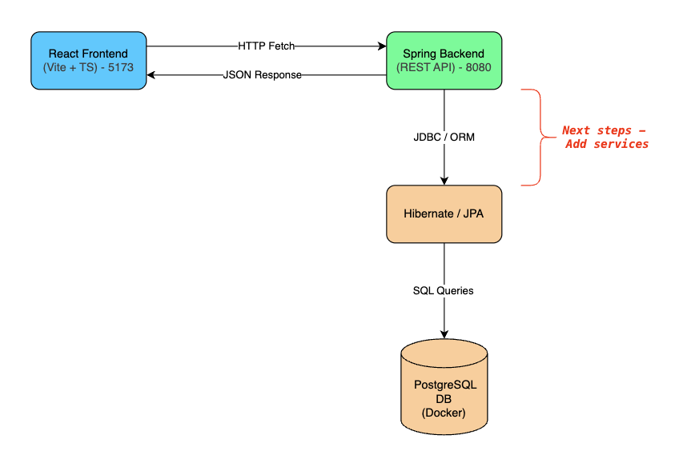

# 💰 Banking App

A modern **full-stack banking application**.

This project is currently being built step by step, starting from a minimal skeleton and evolving into a production-like system.

<br>

## 🔄 Running the App

#### Docker | PostgreSQL

```bash
docker compose up -d
```

#### Backend

```bash
cd backend
./mvnw spring-boot:run
```

> Runs on: http://localhost:8080

#### Frontend

```bash
cd frontend
npm install
npm run dev
```

> Runs on: http://localhost:5173

<br>

## 🟢 Current Features

- **Spring Boot backend** (Java 17+, REST API)
- **React frontend** (Vite + TypeScript)
- Frontend successfully calls a backend API (`/api/users`) and displays the response
  - API (/api/users) fully functional (POST / GET) for retrieving bank users.
- PostgreSQL database integration via Docker

<br>

## ✏️ Architecture

<!-- Entry 1 -->
<details>
<summary>Phase 1</summary>


</details>

<!-- Entry 2-->
<details>
<summary>Phase 2</summary>



</details>

<br>
<br>

## 🧰 Tech Stack

- Frontend

  - React (with Vite + TypeScript)
  - Fetch API for backend communication

- Backend

  - Java 17+
  - Spring Boot
  - REST API
  - Hibernate / JPA ORM

- Database

  - PostgreSQL (Dockerized)
  - Persistent volume for data

- Future Stack Additions
  - JWT authentication
  - GitHub Actions CI/CD
  - Cloud deployment
  - Unit + integration tests

<br>

## 🧭 Roadmap

- Add banking services
- Add authentication (JWT)
- Implement CI/CD pipeline
- Write automated tests
- Extend domain (accounts, transactions, etc.)
