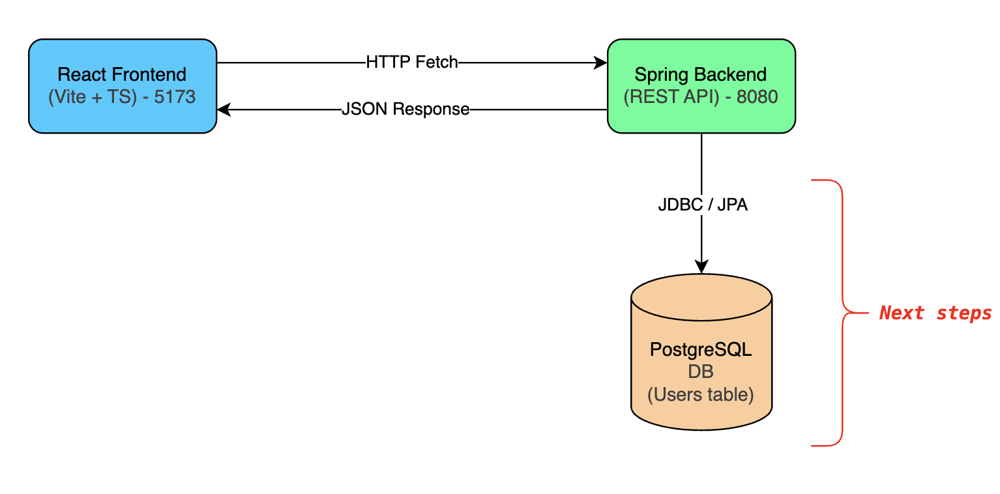
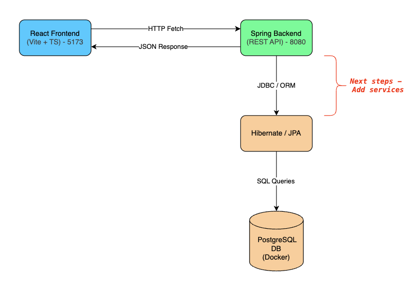
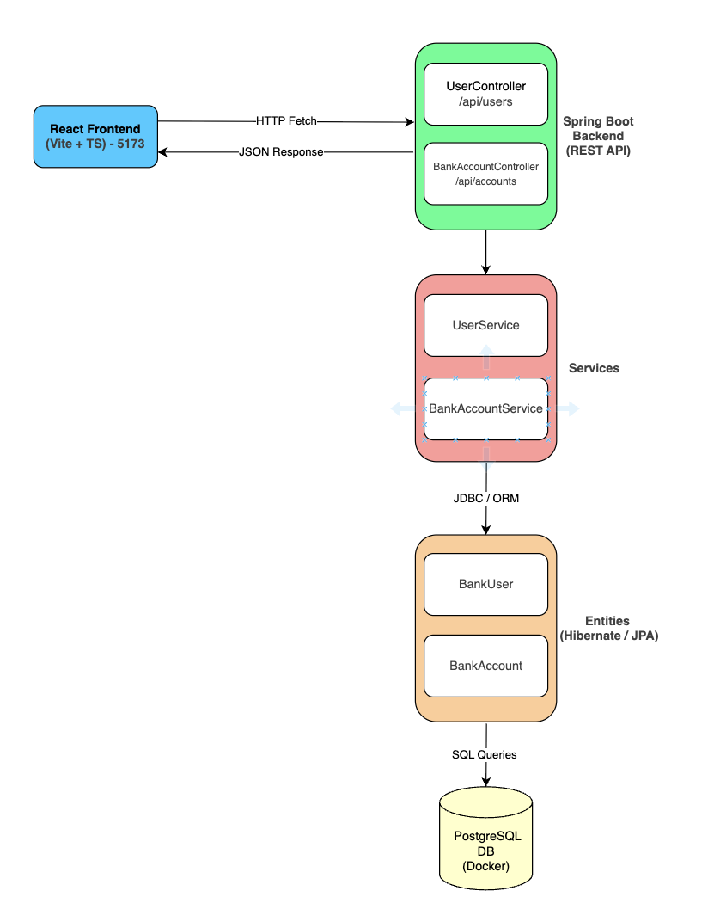

# 💰 Banking App

 &nbsp;&nbsp;&nbsp;  &nbsp;&nbsp;&nbsp;

<br>

A modern **full-stack banking application**.

This project is currently being built step by step, starting from a minimal skeleton and evolving into a production-like system.

<br>

## 🔧 Getting Started

- Java 17+ (Spring Boot backend)
- Maven
- Node.js 18+ and npm
- Docker (running PostgreSQL locally)

<br>

## 🔄 Running the App

#### Docker | PostgreSQL

```bash
docker compose up -d
```

#### Backend

```bash
cd backend
./mvnw spring-boot:run
```

> Runs on: http://localhost:8080

#### Frontend

```bash
cd frontend
npm install
npm run dev
```

> Runs on: http://localhost:5173

<br>

## CI/CD Pipeline

This project uses GitHub Actions for continuous integration:

- **Backend CI**: Automatically builds and tests the Spring Boot application on every push to `backend/`.
- **Automated Testing**: Ensures code quality before merging pull requests.
- **Maven**: Java 17 with automated dependency caching.
- **Code Coverage**: Generates a JaCoCo coverage badge automatically, showing the latest test coverage.

### Running Tests Locally

**Backend:**

```bash
cd backend
mvn clean test
```

> _Frontend CI/CD pipeline coming soon_

<br>

## 🟢 Current Features

- **Spring Boot backend** (Java 17+, REST API)
- **React frontend** (Vite + TypeScript)
- Frontend successfully calls a backend API (`/api/users`) and displays the response
  - API (/api/users) fully functional (POST / GET) for retrieving bank users.
- Backend can perform basic CRUD operations for BankUsers and BankAccounts, with a one-to-many relationship established in the DB.
- PostgreSQL database integration via Docker

<br>

## ✏️ Architecture

<!-- Phase 1 -->
<details>
<summary>Phase 1</summary>
Base project structure, including initialising the front and backend, and ensuring they're communicating with each other.



</details>

<!-- Phase 2-->
<details>
<summary>Phase 2</summary>
Configure PostgreSQL inside a Docker container. Add Lombok to the `BankUser` entity to reduce boilderplate code. Test POST and GET endpoints work in Postman and are reflected in the DB using DBeaver.



</details>

<!-- Phase 3-->
<details>
<summary>Phase 3</summary>
Added Controllers, Services and Entities for `BankUser` and `BankAccount`. Implemented basic logic around CRUD operations, tested in Postman to ensure API calls and endpoints are behaving correctly, and ensured the DB was being reflected accurately.



</details>

<br>
<br>

## 🧰 Tech Stack

- Frontend

  - React (with Vite + TypeScript)
  - Fetch API for backend communication

- Backend

  - Java 17+
  - Spring Boot
  - REST API
  - Hibernate / JPA ORM

- Database

  - PostgreSQL (Dockerized)
  - Persistent volume for data

- Future Stack Additions
  - JWT authentication
  - GitHub Actions CI/CD
  - Cloud deployment
  - Unit + integration tests

<br>

## 🗺️ Roadmap

- Add banking services
- Add authentication (JWT)
- Implement CI/CD pipeline
- Write automated tests
- Extend domain (accounts, transactions, etc.)
